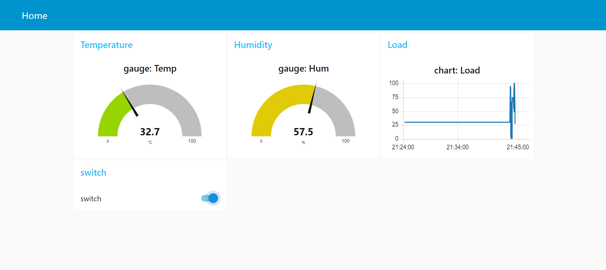
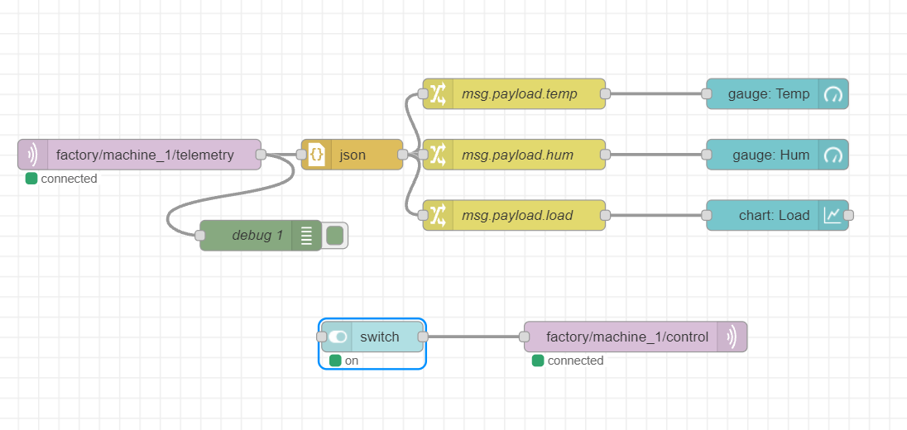
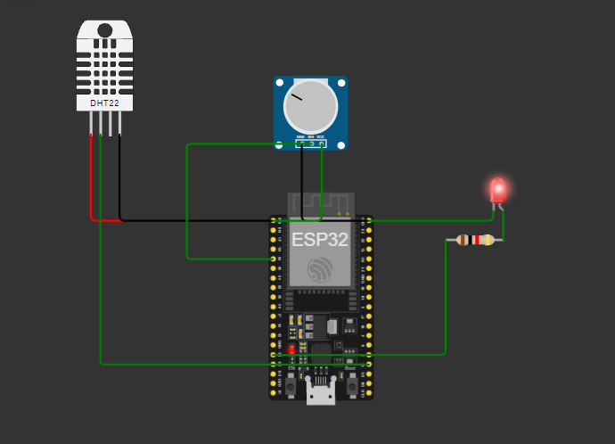
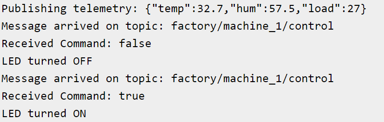

# ESP32 Bidirectional IoT Monitoring and Control using MQTT and Node-RED
# ESP32 Bidirectional IoT Monitoring and Control


A complete bidirectional IoT monitoring and control system developed using an ESP32, MQTT, and Node-RED Dashboard.

The ESP32 continuously monitors temperature, humidity, and machine load using onboard sensors and publishes telemetry data to an MQTT broker. Node-RED subscribes to the telemetry, processes the data, and visualizes it on an interactive dashboard with live gauges and charts.

The dashboard also enables remote control of an LED connected to the ESP32 by publishing MQTT control messages, demonstrating full two-way communication between the edge device and the dashboard.

---

## Features

- Bidirectional MQTT communication
- Real-time temperature monitoring
- Real-time humidity monitoring
- Machine load monitoring
- Interactive Node-RED Dashboard
- Live gauges
- Live charts
- Remote LED control
- JSON-based telemetry
- Wokwi simulation support

---

## Hardware

- ESP32 Development Board
- DHT22 Temperature & Humidity Sensor
- Potentiometer
- LED
- 220 Ω Resistor

---

## Software

- Arduino IDE
- Node-RED
- HiveMQ Public MQTT Broker
- Wokwi Simulator

---

## System Architecture

```

ESP32
│
│ Publish Telemetry
▼
MQTT Broker (HiveMQ)
│
▼
Node-RED
│
├── Dashboard
├── Gauges
├── Charts
│
└── Publish Control Commands
│
▼
ESP32
│
▼
LED

```

---

## Communication Flow

### ESP32 → Node-RED

Publishes sensor telemetry every second (or configured interval).

Topic

```

factory/machine_1/telemetry

```

Example Payload

```json
{
  "temp": 24,
  "hum": 40,
  "load": 62
}
```

---

### Node-RED → ESP32

Publishes LED control commands.

Topic

```

factory/machine_1/control

```

Payload

```

true

```

or

```

false

```

---

## Folder Structure

```

esp32/

Arduino source code

node-red/

Node-RED flow

wokwi/

Simulation files

images/

Project screenshots


```

---

## Installation

### 1. Clone Repository

```bash
git clone https://github.com/MaazMazeMaaz/ESP32-Bidirectional-IoT-Monitoring.git
```

---

### 2. ESP32

Open

```
esp32/sketch.ino
```

Install the following libraries from the Arduino Library Manager:

- WiFi
- PubSubClient
- ArduinoJson
- DHTesp

Upload the sketch to an ESP32.

Alternatively, run the included Wokwi simulation.

---

### 3. Node-RED

Start Node-RED

```bash
node-red
```

Open

```
http://localhost:1880
```

Import

```
node-red/flows.json
```

Click **Deploy**.

---

### 4. Dashboard

Open

```
http://localhost:1880/ui
```

---

## Dashboard

The dashboard provides:

- Temperature Gauge
- Humidity Gauge
- Load Trend
- LED Control Switch

---

## Testing

### Temperature

Modify the DHT22 temperature in Wokwi.

Expected Result

- Temperature gauge updates

---

### Humidity

Modify the DHT22 humidity.

Expected Result

- Humidity gauge updates

---

### Machine Load

Rotate the potentiometer.

Expected Result

- Load chart updates

---

### LED Control

Toggle the dashboard switch.

Expected Result

- LED turns ON/OFF
- ESP32 receives MQTT command
- Serial Monitor displays received command

---

## Required Arduino Libraries

- WiFi
- PubSubClient
- ArduinoJson
- DHTesp

---

## Required Node-RED Packages

- node-red-dashboard (or FlowFuse Dashboard)

---

## MQTT Topics

| Topic | Publisher | Subscriber | Description |
|--------|-----------|------------|-------------|
| `factory/machine_1/telemetry` | ESP32 | Node-RED | Sensor telemetry |
| `factory/machine_1/control` | Node-RED | ESP32 | LED control |

---

## Screenshots

### Dashboard



---

### Node-RED Flow



---

### Wokwi Circuit



---

### Serial Monitor



---

## Future Improvements

- Cloud database integration
- Data logging
- Multiple ESP32 devices
- Email/SMS alerts
- Mobile dashboard
- OTA firmware updates
- Home Assistant integration


## Author

**Muhammad Maaz**

B.Sc. Mechatronics Engineering

GitHub: https://github.com/MaazMazeMaaz
